# Car Model API: Comparison Between Spring and Quarkus Frameworks
## Overview
This repository hosts the "Car Model API," a Java-based application crafted to compare the build and performance of RESTful APIs using two prominent frameworks: **Spring Boot** and **Quarkus**.   
The primary goal of this project is to demonstrate the capabilities and differences between these frameworks through a practical implementation.   
The API manages various car model data elements, including brands, types, colors, and engine specifications, providing a robust dataset to showcase each framework's features.

## Project Description
This project is structured to facilitate a direct comparison between constructing a REST API with Spring Boot and with Quarkus. 
Upon launching the application, a data.sql script automatically populates the database with initial data to enable immediate interaction with the API.

```mermaid
classDiagram
    class Brand {
      -name: String
      -slug: String
      -id: Long
      -models: List~Model~
    }
    class CarType {
      -id: int
      -slug: String
      -models: List~Model~
      -name: String
    }
    class Color {
      -hexRef: String
      -models: List~Model~
      -rvbRef: String
      -id: int
      -name: String
    }
    class Engine {
      -models: List~Model~
      -fuelType: FuelType
      -id: int
      -slug: String
      -name: String
      -power: String
    }
    class Model {
      -engine: Engine
      -name: String
      -carTypes: List~CarType~
      -colors: List~Color~
      -brand: Brand
      -transmissions: Set~Transmission~
      -slug: String
      -id: Long
    }

    Model "1" <--> "0..n"Brand
    Engine "0..n" --* "1..n" Model
    CarType "0..n" --* "1..n" Model
    Color "0..n" --* "1..n" Model
    
    

    style Brand fill:#292929, stroke-width:2px, stroke:#000
    style CarType fill:#292929, stroke-width:2px, stroke:#000 
    style Color fill:#292929, stroke-width:2px, stroke:#000
    style Engine fill:#292929, stroke-width:2px, stroke:#000
    style Model fill:#000, stroke:#333, stroke-width:3px
```

  
Diagram

### Key Points
**Mock Data Usage:** The data injected by data.sql are for demonstration purposes only and are not meant to be reliable or used in a production environment.  
**Framework Comparison:** Explore how each framework handles configurations, RESTful operations, data management, and more.
### Technologies
**Java:** Core programming language.  
**Spring Boot and Quarkus:** For the framework-specific implementations.  
**Maven:** Used for dependency management and project build processes.

## SPRINGBOOT
This project adopts a layered architectural approach, designed to enhance modularity and separation of concerns.  
Each layer has specific responsibilities, enabling independent development and maintenance.

  
Dependencies

The Car Model API leverages a range of dependencies to facilitate development and operational functionalities.   
Below is an overview of the key dependencies in use:

**Data JPA:** Provides integration with Spring Data JPA for database operations.

**Security:** Offers authentication and authorization capabilities.

**Validation:** Supports validation mechanisms for request data.

**Web:** Enables building web applications including RESTful services using Spring MVC.

**Tomcat:** Embedded Tomcat server for running the application.

**Devtools:** Facilitates application development with features like automatic restarts.

**PostgreSQL:** JDBC driver for connecting to PostgreSQL databases.

**Lombok:** Simplifies the codebase by reducing boilerplate through annotations.

**Spring Security Test:** Provides support for testing Spring Security integration.

**Hibernate Core:** (Version 6.3.1.Final) ORM framework for handling database interactions.

**Springdoc OpenAPI UI:** (Version 2.0.3) Facilitates API documentation and testing through Swagger UI.

  
Annotations in use 

Here are the annotations in use in the springboot branch.

**@JsonIdentityInfo (Jackson):** Prevents recursion problems by identifying instances through a property (usually id), primarily used in JSON serialization processes.  

**@Data (Project Lombok):** Generates boilerplate code such as getters, setters, equals, hashCode, and toString methods automatically.  

**@NoArgsConstructor (Project Lombok):** Creates an empty constructor for the class.  

**@AllArgsConstructor (Project Lombok):** Generates a constructor with one parameter for each field in the class.  

**@Entity (JPA/Hibernate):** Marks the class as a JPA entity, meaning it's linked to a database table.  

**@Id (JPA/Hibernate):** Designates the field as the primary key of the entity.  

**@GeneratedValue (JPA/Hibernate):** Specifies that the primary key is automatically generated by the database, following the defined strategy.  

**@Column (JPA/Hibernate):** Maps a field to a database column and allows additional configurations like naming.  

**@JsonView (Jackson):** Controls the serialization visibility of JSON properties based on defined views.  

**@ManyToOne (JPA/Hibernate):** Defines a single-valued association to another entity class that has many-to-one multiplicity.  

**@JoinColumn (JPA/Hibernate):** Specifies the mapped column for joining an entity association or element collection.  

**@ManyToMany (JPA/Hibernate):** Defines a many-valued association with many-to-many multiplicity.  

**@JoinTable (JPA/Hibernate):** Specifies the join table that maps the many-to-many or one-to-many relationship.  

**@ElementCollection (JPA/Hibernate):** Defines a collection of instances of a basic type or embeddable class.  

**@Enumerated (JPA/Hibernate):** Specifies that a persistent property or field should be persisted as an enumerated type. 

**@CollectionTable (JPA/Hibernate):** Specifies the table that stores the elements of a collection.  

**@NotBlank (Bean Validation):** Asserts that a string is not null and its trimmed length is greater than zero. 

**@RestController (Spring Web):** Indicates that the annotated class is a controller where every method returns a domain object instead of a view.

**@RequestMapping (Spring Web):** Maps HTTP requests to handler methods of MVC and REST controllers. 

**@RequiredArgsConstructor (Project Lombok):** Generates a constructor with required arguments. Required arguments are final fields and fields with constraints such as @NonNull. 

**@Component (Spring Framework):** Indicates that the class is a Spring component, making it eligible for Spring Dependency Injection and other Spring features.  

**@EnableWebSecurity (Spring Security):** Enables Spring Security’s web security support and provides the Spring MVC integration. 

**@EnableMethodSecurity (Spring Security):** Enables method-level security based on annotations.  

**@Service (Spring Framework):** Indicates that the annotated class is a service class, a specialization of the component for service-layer logic.  

**@Transactional (Spring Framework):** Specifies that the annotated class or method must be executed within a transactional context.  

## QUARKUS

## Getting Started

